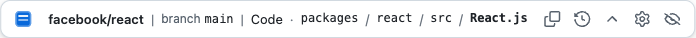

# RepoDock — a GitHub context dock for Chrome, Edge & Firefox

[](https://github.com/vlyl/repodock/actions/workflows/ci.yml)
[](LICENSE)
[](https://developer.chrome.com/docs/extensions/develop/migrate/what-is-mv3)
[](#browser-support)

**RepoDock is a free, open-source browser extension for Chrome, Edge, and Firefox
that pins an always-visible context bar to GitHub.** It shows exactly where you
are — repository, branch / tag / commit, page location (Code, Pull Request,
Issue, Actions…), file path, and line range — no matter how far you scroll or how
GitHub's client-side navigation moves you around. It also keeps a private,
local history of the GitHub pages you've visited and gives you one-click
quick-nav to any section of the current repository.



> `facebook/react · branch main · Code · packages / react / src / React.js`

## Why

GitHub's own context (breadcrumbs, branch picker) scrolls away and is easy to
lose track of during long sessions and rapid client-side navigation. RepoDock
keeps an accurate, glanceable summary pinned to the edge of the viewport, with
one-click navigation back to any part of the current context and a private,
local history of the GitHub pages you've visited.

## Features

- **Always-visible context** — repository, ref (branch / tag / commit / PR
  head·base), location (Code, Pull Request, Issue, Actions, …), repository path,
  current file, and selected line range.
- **Accuracy first** — every value is resolved with a known source and
  confidence. RepoDock never guesses a branch and never shows stale context from
  the previous page. Unknown values are simply omitted.
- **Unobtrusive by design** — a compact dock pinned to the bottom-left (default)
  or bottom-right corner. It never pushes or covers GitHub's content, and can
  optionally auto-hide to a small handle until you hover it. The side persists
  across tabs, reloads, and sessions.
- **Recent pages** — a list that pops up on demand, grouped by repository and
  sorted newest-first, drawn from the pages you visit _and_ your existing
  github.com browser history, with search, pinning, and quick navigation.
  Browser-history import is optional.
- **Jump anywhere** — configurable GitHub-section quick-nav buttons (Code,
  Issues, Pull requests, Actions, Projects, Wiki, Discussions, Security,
  Insights, Releases, Settings) right in the dock, with the current section
  highlighted. Choose which to show in settings; all are shown by default.
- **Sticky GitHub header (optional)** — pin GitHub's own repository header (the
  name and the Code / Issues / Pull requests nav) to the top so it stays visible
  while you scroll. Off by default; toggle it from the popup or options.
- **Keyboard friendly** — a configurable shortcut toggles the dock; Escape closes
  panels; everything is reachable by keyboard.
- **Themed to match GitHub** — follows GitHub's light/dark theme, or force one.
- **Private by design** — history is stored locally and never synced; only
  settings sync. No page content, comments, tokens, or session data are ever
  recorded.

## Who it's for

RepoDock helps anyone who spends time navigating GitHub in the browser:

- **Developers reviewing pull requests** across many files who lose track of the
  branch, file, or line as the page scrolls.
- **Open-source maintainers** juggling several repositories who want one-click
  jumps between Issues, Pull requests, Actions, and Releases.
- **Engineers doing code review or auditing** who need an accurate, never-stale
  breadcrumb and a fast way to revisit exact file and line locations.
- **Anyone who reads a lot of code on GitHub** and wants a private, searchable
  history of recently visited pages, grouped by repository.

## Browser support

| Browser | Status       | Manifest |
| ------- | ------------ | -------- |
| Chrome  | Supported    | MV3      |
| Edge    | Supported    | MV3      |
| Firefox | Supported    | MV3      |
| Safari  | Compatible\* | —        |

\* Safari is architecture-compatible but not a v1 release target.

## Install (from source)

RepoDock is not yet on the extension stores. To run a development build:

```bash
corepack enable
pnpm install
pnpm dev            # Chrome (launches a dev browser with the extension loaded)
pnpm dev:firefox    # Firefox
```

To produce a production build and store ZIPs:

```bash
pnpm build:all      # .output/chrome-mv3, firefox-mv3, edge-mv3
pnpm zip:all        # store ZIPs + a Firefox source ZIP
```

Then load the unpacked extension:

- **Chrome / Edge** → `chrome://extensions` → enable Developer mode → _Load
  unpacked_ → select `.output/chrome-mv3`.
- **Firefox** → `about:debugging` → _This Firefox_ → _Load Temporary Add-on_ →
  select `.output/firefox-mv3/manifest.json`.

## Usage

- The dock sits in the bottom-left corner of any `github.com` page as a single
  bar: the **logo** pops up the recent-pages list, the live **context** shows
  where you are, and the inline **section buttons** (Code, Issues, Pull requests,
  …) jump anywhere in the current repository.
- Toggle visibility anywhere with the keyboard shortcut (default `Alt+Shift+D`;
  change it at `chrome://extensions/shortcuts` or Firefox's _Manage Extension
  Shortcuts_).
- The toolbar **popup** is the control center — show/hide the dock, switch side
  and density, toggle history recording, open the recent list, and reach all
  settings — with a context preview for the active tab.

## Development

| Command              | Description                                          |
| -------------------- | ---------------------------------------------------- |
| `pnpm dev`           | Run the Chrome dev build with HMR                    |
| `pnpm typecheck`     | `wxt prepare` + `tsc --noEmit`                       |
| `pnpm lint`          | ESLint (type-aware)                                  |
| `pnpm format`        | Prettier (write)                                     |
| `pnpm test`          | Vitest unit + component tests                        |
| `pnpm test:coverage` | Vitest with coverage thresholds                      |
| `pnpm e2e`           | Build Chrome + Playwright extension/E2E/visual tests |
| `pnpm check`         | Typecheck + lint + format check + tests              |
| `pnpm build:all`     | Production builds for all targets                    |
| `pnpm icons`         | Regenerate the PNG icon set                          |

### First-time E2E setup

```bash
pnpm e2e:install   # download the Playwright Chromium
pnpm e2e
```

Visual baselines are created on first run and are platform-specific (Playwright
suffixes them with the OS, e.g. `dock-darwin.png`). CI regenerates Linux
baselines on each run; commit them if you want true visual-regression gating.

## Architecture

```
src/
├─ core/               # Framework-agnostic domain logic (fully unit-tested)
│  ├─ context/         # GitHub context model + URL/DOM resolution + presentation
│  ├─ history/         # Extension-owned recent-page history
│  ├─ settings/        # User settings (Zod-validated, sync storage)
│  └─ storage/         # Versioned, validated persistence over WXT storage
├─ lib/                # Logger, typed messaging, navigation controller
├─ ui/                 # React UI: theme, shared controls, the dock, hooks
├─ i18n/               # Localization-ready string catalog (English initial)
└─ entrypoints/        # WXT entrypoints: content script, background, popup, options
```

The context **resolver** treats the URL as the authoritative, highest-trust
source for structure, and refines ambiguous splits (e.g. branch names containing
slashes) and item titles from the page DOM — but only when the DOM's repository
agrees with the URL, which guards against stale context during client-side
navigation. See [`docs/architecture.md`](docs/architecture.md) and the
[Architecture Decision Records](docs/adr/).

## Privacy

RepoDock records only sanitized navigation metadata, locally, and makes no
network requests. It never stores page content, issue/PR text, comments, copied
code, OAuth codes, tokens, or session values. With the optional **Include browser
history** setting it reads your github.com history (only) locally to fill the
recent list — it never reads non-github.com entries, deletes history, or
transmits anything. See [`docs/privacy.md`](docs/privacy.md).

## FAQ

### What is RepoDock?

RepoDock is a free, open-source browser extension that adds a persistent context
bar to GitHub. It always shows your current repository, branch or tag, page
location, file path, and line range, and offers one-click navigation plus a
private history of recently visited GitHub pages.

### Which browsers does RepoDock support?

Chrome, Microsoft Edge, and Firefox, all on Manifest V3. The codebase is also
architecture-compatible with Safari, though Safari is not a v1 release target.

### Is RepoDock free and open source?

Yes. RepoDock is MIT-licensed and the full source is on GitHub. It is an
independent project and is not affiliated with GitHub.

### Does RepoDock collect or send my data?

No. RepoDock makes no network requests and stores everything locally. It never
records page content, issue or pull-request text, comments, tokens, or session
data — only your settings sync, through the browser's own settings sync.

### How is RepoDock different from Refined GitHub?

RepoDock is a focused, single-purpose tool: an accurate, always-visible context
bar, a private recent-pages history, and section quick-nav. It does not restyle
GitHub's pages or depend on Refined GitHub, and it is built to never show stale
context during GitHub's client-side (Turbo) navigation.

### Does RepoDock keep the GitHub breadcrumb visible while scrolling?

Yes — that's the core feature. GitHub's own breadcrumb and branch picker scroll
out of view; RepoDock keeps an accurate summary pinned to the corner of the
viewport at all times.

### How do I install RepoDock?

Until it's published on the extension stores, build it from source with pnpm and
load the unpacked extension. See [Install (from source)](#install-from-source).

### How do I keep a history of the GitHub pages I've visited?

RepoDock records a private, local list of GitHub pages, grouped by repository and
sorted newest-first, with search and pinning. You can optionally include your
existing github.com browser history.

## License

[MIT](LICENSE) © RepoDock contributors. Not affiliated with GitHub. "GitHub" is a
trademark of GitHub, Inc.
